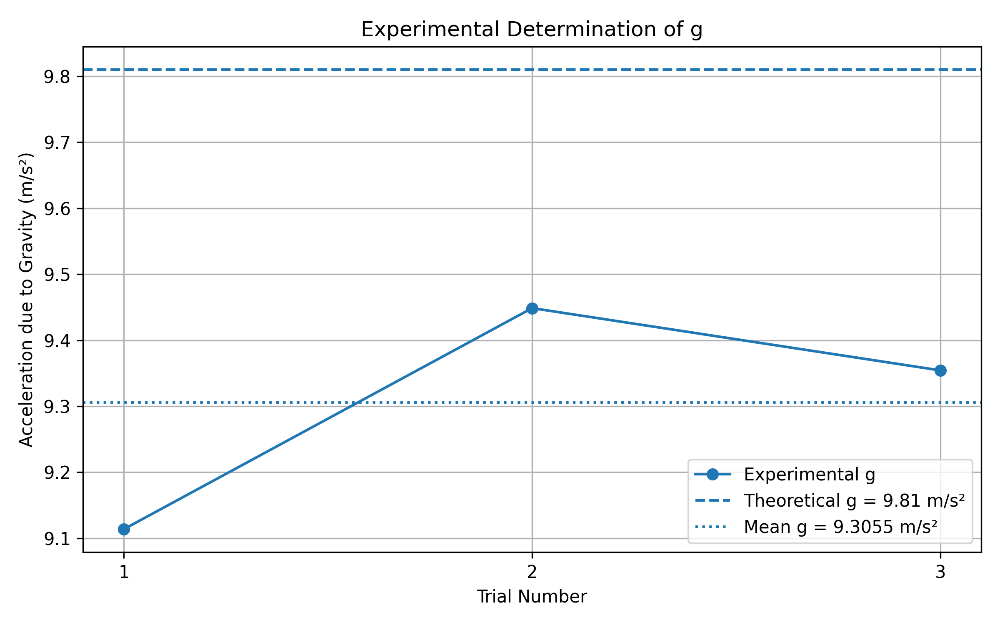

# Experimental Determination of Acceleration Due to Gravity Using Video Analysis and Python

## 📌 Overview

This project experimentally determines the acceleration due to gravity (g) by analysing the motion of a freely falling object using video analysis and Python.

Instead of manually measuring the fall time using a stopwatch, the experiment uses computer vision to track the falling object frame-by-frame.

The project combines Physics, Computer Vision, Data Analysis, and Python programming.

---

## 🎯 Objective

The objectives of this project are:

- To record the motion of a freely falling object using a camera.
- To detect and track the object using OpenCV.
- To convert pixel displacement into real-world distance.
- To calculate time from video frame numbers and FPS.
- To determine the experimental value of acceleration due to gravity.
- To analyse the experimental data using regression.
- To compare the experimental value with the theoretical value of 9.81 m/s².

---

## 🧰 Technologies Used

- Python
- OpenCV
- NumPy
- Pandas
- Matplotlib

---

## ⚙️ Experimental Setup

- Approximate falling height: 1.30 m
- Camera frame rate: 30 FPS
- Video resolution: 1080 × 1920
- Number of trials: 3
- Falling object: Red object

---

## 🧠 Physics

For an object falling from rest:

s = 1/2 gt²

More generally:

s = ut + 1/2 gt²

The experimental data is fitted using:

s = at² + bt

where:

a = g/2

Therefore:

g = 2a

---

## 🔬 Methodology

The complete experimental pipeline is:

Video Recording
        ↓
Frame Extraction
        ↓
Red Object Detection
        ↓
Contour Detection
        ↓
Object Centre Tracking
        ↓
Pixel-to-Metre Calibration
        ↓
Displacement-Time Data
        ↓
Regression Analysis
        ↓
Calculation of g
        ↓
Statistical Analysis

---

## 👁️ Computer Vision Approach

The falling object is detected using its red colour.

The video frame is converted from BGR to HSV colour space.

Red colour regions are isolated using HSV thresholding.

Morphological operations are applied to reduce noise.

Contours are detected from the resulting binary mask.

The centre of the detected object is calculated from its bounding box.

To improve tracking reliability, the detected position in the previous frame is used to select the nearest valid candidate in the next frame.

---

## 📏 Pixel-to-Metre Calibration

A known distance of 1.30 m was used for calibration.

The measured pixel distance was:

1795 pixels = 1.30 m

Therefore:

meters per pixel = 1.30 / 1795

This conversion factor is used to convert the measured pixel displacement into displacement in metres.

---

## ⏱️ Time Calculation

The video was recorded at 30 FPS.

Therefore:

t = frame number / FPS

or:

t = frame number / 30

---

## 📊 Experimental Results

Three independent trials were performed.

| Trial | Experimental g (m/s²) | Error (%) | R² |
|------:|----------------------:|----------:|---:|
| 1 | 9.1137 | 7.10 | 0.99878 |
| 2 | 9.4486 | 3.68 | 0.99943 |
| 3 | 9.3543 | 4.65 | 0.99919 |

### Final Result

Mean experimental value:

**g = 9.3055 m/s²**

Standard deviation:

**0.1727 m/s²**

Theoretical value:

**9.81 m/s²**

Mean percentage error:

**5.14%**

Therefore:

**Experimental g = 9.3055 ± 0.1727 m/s²**

---

## 📈 Graphs
## Results



The project generates graphs showing:

1. Displacement vs Time
2. Displacement vs Time² with regression
3. Experimental g for different trials compared with theoretical g

---

## ⚠️ Sources of Error

Possible sources of experimental error include:

- Camera frame-rate limitation
- Pixel-to-metre calibration error
- Object-centre detection error
- Camera alignment and perspective
- Small variations in the release of the object
- Video resolution limitations
- Tracking noise

---

## 🚀 Future Improvements

Possible improvements include:

- Automatic calibration
- GUI-based interface
- Better object detection using advanced computer vision
- Automatic detection of the release frame
- More experimental trials
- Uncertainty propagation
- Real-time gravity estimation
- Support for different coloured objects

---

## ▶️ How to Run

Install the required libraries:

```bash
pip install opencv-python numpy pandas matplotlib
